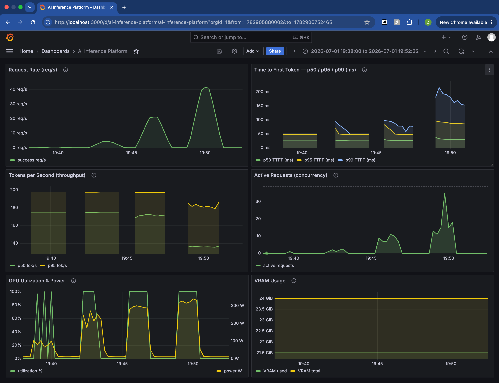

# AI Inference Platform

Production-style LLM serving system built on **vLLM + FastAPI**, developed across 13 milestones covering structured logging, Prometheus metrics, multi-turn sessions, GPU monitoring, Grafana dashboards, Locust load testing, AWQ INT4 quantization, request queue backpressure, per-IP rate limiting, a pytest suite, and a GitHub Actions CI pipeline with performance regression gates.

---

## Architecture

```
                         ┌─────────────────────────────────────────┐
                         │              Client (HTTP)               │
                         └────────────────────┬────────────────────┘
                                              │ POST /v1/chat/completions
                                              ▼
                         ┌─────────────────────────────────────────┐
                         │        FastAPI Gateway (port 8000)       │
                         │                                          │
                         │  ┌──────────────────────────────────┐   │
                         │  │  Middleware (ASGI layer)          │   │
                         │  │  1. Rate limiter (per-IP token    │   │
                         │  │     bucket, M9)                   │   │
                         │  │  2. Trace ID injector (M1)        │   │
                         │  └───────────────┬──────────────────┘   │
                         │                  │                        │
                         │  ┌───────────────▼──────────────────┐   │
                         │  │  Request handler                  │   │
                         │  │  • Session store  (M3)            │   │
                         │  │  • Context window (M3)            │   │
                         │  │  • Queue / backpressure (M8)      │   │
                         │  └───────────────┬──────────────────┘   │
                         │                  │ async httpx stream     │
                         │  ┌───────────────▼──────────────────┐   │
                         │  │  Side-cars (background tasks)     │   │
                         │  │  • Structured JSON logger (M1)    │   │
                         │  │  • Prometheus metrics (M2)        │   │
                         │  │  • GPU monitor (M4)               │   │
                         │  │  • Session TTL sweeper (M3)       │   │
                         │  └──────────────────────────────────┘   │
                         └────────────────────┬────────────────────┘
                                              │
                         ┌────────────────────▼────────────────────┐
                         │          vLLM Engine (port 6006)         │
                         │  Qwen2.5-7B-Instruct AWQ INT4            │
                         │  PagedAttention + Continuous Batching    │
                         │  awq_marlin kernel · max-num-seqs=256    │
                         └──────────┬──────────────────────────────┘
                                    │
              ┌─────────────────────┼─────────────────────┐
              ▼                     ▼                       ▼
 ┌────────────────────┐  ┌──────────────────────┐  ┌──────────────────────┐
 │   Prometheus        │  │  Grafana (port 3000)  │  │  CI (GitHub Actions) │
 │   (port 9090)       │◄─│  GPU + gateway        │  │  lint → typecheck    │
 │   scrapes /metrics  │  │  dashboards           │  │  → test → regression │
 └────────────────────┘  └──────────────────────┘  └──────────────────────┘
```

---

## Key Results

### FP16 vs AWQ INT4 — 50 concurrent users

| Metric | FP16 (M6) | AWQ INT4 + seqs=256 (M11) | Change |
|---|---|---|---|
| TTFT p99 (ms) | 219 | 240 | comparable (+10%) |
| End-to-end p99 (ms) | 1335 | 585 | **-56%** |
| Throughput p50 (tok/s) | 53.8 | 157.1 | **+192%** |
| Model VRAM (GB) | ~14.0 | 5.29 | **-62%** |
| KV cache available (GB) | 2.65 | 13.93 | **+426%** |
| Est. saturation point | ~50–80 users | ~150+ users | — |

### FP16 baseline — throughput scaling

| Concurrency | RPS | Aggregate tok/s | TTFT p99 (ms) |
|---|---|---|---|
| 1 user | 0.36 | 22 | 54 |
| 10 users | 3.42 | 197 | 94 |
| 50 users | 16.34 | 879 | 219 |
| 100 users | 28.01 | 1387 | 726 |

---

## Load Test Results — AWQ INT4 Model

| Concurrency | TTFT p99 | Total p99 | TPS p50 |
|---|---|---|---|
| 1 user    |  38 ms |  402 ms | 156 tok/s |
| 10 users  |  91 ms |  422 ms | 154 tok/s |
| 50 users  | 150 ms |  500 ms | 146 tok/s |
| 100 users | 310 ms |  693 ms | 132 tok/s |

*vs FP16 baseline (50 users): TTFT p99=219ms, Total p99=1335ms, TPS=54 tok/s*

Live Grafana dashboard captured during 1→100 concurrent user ramp
(AWQ INT4 + awq_marlin kernel + max-num-seqs=256):



---

## Milestone Map

| Milestone | What it built | Key files |
|---|---|---|
| M1 | Structured async JSON logger + trace ID | `gateway/logger.py` |
| M2 | Prometheus metrics (TTFT, TPS, queue depth) | `gateway/metrics.py` |
| M3 | Multi-turn sessions + sliding-window context truncation | `gateway/session_store.py`, `gateway/context_manager.py` |
| M4 | GPU utilization + VRAM monitoring via `nvidia-smi` | `gateway/gpu_monitor.py` |
| M5 | Grafana dashboards (GPU + gateway panels) | `monitoring/grafana/dashboard.json` |
| M6 | Locust load testing (1–100 concurrent users, FP16 baseline) | `load_testing/locustfile.py`, `docs/benchmark_report.md` |
| M7 | Bottleneck analysis (KV cache pressure, saturation at 50–80 users) | `docs/benchmark_report.md` |
| M8 | Bounded concurrency queue + 503 backpressure | `gateway/queue_manager.py` |
| M9 | Per-IP Token Bucket rate limiter (ASGI middleware) | `gateway/rate_limiter.py` |
| M10 | AWQ INT4 quantization via llm-compressor + awq_marlin kernel | `scripts/quantize_awq.py`, `docs/quant_report.md` |
| M11 | vLLM parameter tuning (max-num-seqs sweep, Config C wins) | `scripts/benchmark_quant.py`, `docs/tuning_report.md` |
| M12 | pytest suite (37 unit + integration tests) | `tests/` |
| M13 | GitHub Actions CI + performance regression gate | `.github/workflows/ci.yml`, `scripts/check_regression.py`, `baseline.json` |

---

## Project Structure

```
AI-Inference-Platform/
├── gateway/                   # FastAPI gateway package
│   ├── main.py                # App entrypoint, routes, middleware
│   ├── logger.py              # Structured async JSON logger
│   ├── metrics.py             # Prometheus counters / histograms
│   ├── session_store.py       # In-memory session state + TTL sweep
│   ├── context_manager.py     # Sliding-window context truncation
│   ├── gpu_monitor.py         # nvidia-smi polling → Prometheus gauges
│   ├── queue_manager.py       # Asyncio semaphore backpressure
│   └── rate_limiter.py        # Per-IP token bucket
├── scripts/
│   ├── download_model.py      # Pull Qwen2.5-7B from ModelScope
│   ├── quantize_awq.py        # FP16 → AWQ INT4 via llm-compressor
│   ├── benchmark_quant.py     # Post-quantization Locust sweep
│   ├── tuning_sweep.sh        # vLLM parameter sweep driver
│   └── check_regression.py    # CI regression gate vs baseline.json
├── load_testing/
│   ├── locustfile.py          # Locust user class + tasks
│   └── test_stream.py         # Manual SSE stream verifier
├── tests/
│   ├── conftest.py
│   ├── test_rate_limiter.py
│   ├── test_context_manager.py
│   ├── test_session_store.py
│   └── test_gateway.py
├── monitoring/
│   ├── prometheus.yml         # Scrape config
│   └── grafana/
│       └── dashboard.json     # GPU + gateway Grafana dashboard
├── docs/
│   ├── benchmark_report.md    # FP16 load test results (M6)
│   ├── quant_report.md        # FP16 vs AWQ comparison (M10)
│   └── tuning_report.md       # max-num-seqs tuning results (M11)
├── baseline.json              # Committed perf baseline for CI gate
├── requirements.txt
├── pyproject.toml             # ruff + mypy + pytest config
└── .github/workflows/ci.yml   # CI pipeline
```

---

## Setup

### Prerequisites

- Python 3.11+
- NVIDIA GPU with CUDA (tested on RTX 4090 D, 25.76 GB VRAM)
- vLLM installed in the serving environment

### Install dependencies

```bash
pip install -r requirements.txt
```

### Download the model

```bash
MODEL_OUTPUT_DIR=/path/to/models python scripts/download_model.py
```

### Quantize to AWQ INT4 (one-time, ~10–30 min)

```bash
FP16_MODEL_PATH=/path/to/models/Qwen2.5-7B-Instruct/Qwen/Qwen2.5-7B-Instruct \
OUTPUT_PATH=/path/to/models/Qwen2.5-7B-Instruct-INT4 \
python scripts/quantize_awq.py
```

---

## Running the Gateway

### 1. Start vLLM

```bash
vllm serve /path/to/models/Qwen2.5-7B-Instruct-INT4 \
  --quantization awq_marlin \
  --max-num-seqs 256 \
  --gpu-memory-utilization 0.90 \
  --max-model-len 4096 \
  --port 6006
```

### 2. Start the gateway

```bash
MODEL_PATH=/path/to/models/Qwen2.5-7B-Instruct-INT4 \
VLLM_URL=http://localhost:6006/v1/chat/completions \
LOG_PATH=logs/gateway.jsonl \
uvicorn gateway.main:app --host 0.0.0.0 --port 8000
```

### 3. Send a request

```bash
curl -X POST http://localhost:8000/v1/chat/completions \
  -H "Content-Type: application/json" \
  -d '{
    "messages": [{"role": "user", "content": "What is PagedAttention?"}],
    "max_tokens": 200,
    "stream": true
  }'
```

### Endpoints

| Endpoint | Method | Description |
|---|---|---|
| `/v1/chat/completions` | POST | Streaming chat (SSE) |
| `/health` | GET | Gateway health check |
| `/metrics` | GET | Prometheus metrics |

---

## Running Tests

```bash
pytest tests/ -v
```

The suite has 37 tests covering rate limiting, context window truncation, session store TTL, and gateway integration. Tests mock all GPU and vLLM dependencies — no GPU required.

### Run CI checks locally

```bash
ruff check .
mypy gateway/ --ignore-missing-imports --no-strict-optional
pytest tests/ -v
```

---

## Monitoring Setup

### Prometheus

```bash
docker run -p 9090:9090 \
  -v $(pwd)/monitoring/prometheus.yml:/etc/prometheus/prometheus.yml \
  prom/prometheus
```

### Grafana

```bash
docker run -p 3000:3000 grafana/grafana
```

Import `monitoring/grafana/dashboard.json` via **Dashboards → Import**.

The dashboard includes GPU utilization and VRAM, request rate and error rate, TTFT and end-to-end latency histograms (p50/p95/p99), and active sessions + queue depth.

---

## CI Pipeline

```
lint (ruff)
    └── typecheck (mypy gateway/)
    └── test (pytest tests/)
            └── regression (check_regression.py vs baseline.json)
```

The regression gate fails the build if any metric degrades beyond its threshold:

| Metric | Threshold |
|---|---|
| TTFT p99 | +15% |
| End-to-end p99 | +15% |
| Throughput p50 | -10% |

To update the baseline after a verified improvement, edit `baseline.json` and commit it.

---

## Environment Variables

| Variable | Required | Default | Description |
|---|---|---|---|
| `MODEL_PATH` | **Yes** | — | Path to the quantized model directory |
| `VLLM_URL` | No | `http://localhost:6006/v1/chat/completions` | vLLM endpoint |
| `LOG_PATH` | No | `logs/gateway.jsonl` | Structured log output path |
| `MODEL_OUTPUT_DIR` | No | `/root/autodl-tmp/models/Qwen2.5-7B-Instruct` | Model download destination |
| `FP16_MODEL_PATH` | No | `/root/autodl-tmp/models/.../Qwen2.5-7B-Instruct` | Source model for quantization |
| `OUTPUT_PATH` | No | `/root/autodl-tmp/models/Qwen2.5-7B-Instruct-INT4` | Quantized model output path |
